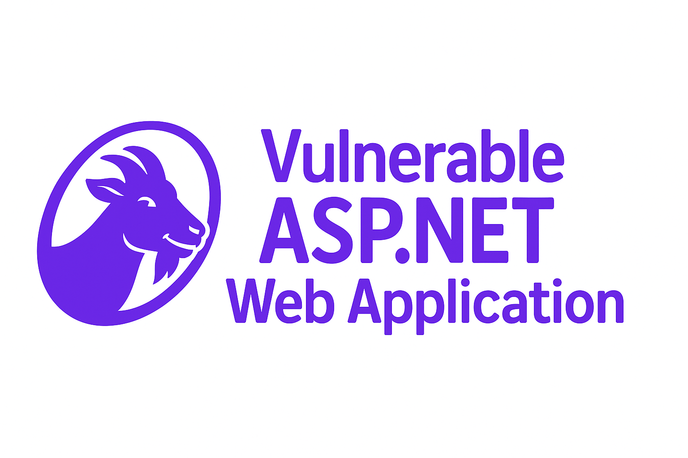

<p align="center">
  
</p>

<h1 align="center">🐐 AspGoat</h1>

<p align="center">
  <i>An intentionally vulnerable ASP.NET Core web application for learning and practicing Web Application Security.</i>
</p>

<p align="center">
  <a href="https://github.com/Soham7-dev/AspGoat/blob/main/LICENSE">
    
  </a>
  <a href="https://github.com/Soham7-dev/AspGoat/stargazers">
    
  </a>
  <a href="https://github.com/Soham7-dev/AspGoat/network/members">
    
  </a>
  <a href="https://github.com/Soham7-dev/AspGoat/actions">
    
  </a>
  <a href="https://hub.docker.com/r/YOUR_DOCKERHUB_USERNAME/aspgoat">
    
  </a>
</p>

---

## 📖 About AspGoat

**AspGoat** is an intentionally vulnerable **ASP.NET Core** application that helps Security Engineers and Developers analyze and mitigate common web application vulnerabilities. 
It includes the **OWASP Top 10** and beyond, providing hands-on Application Security challenges.

⚠️ **Disclaimer**: This project is for **educational purposes only**. Do **not** deploy to production environments.  

---

# ✨ Features

- 🐞 Intentionally vulnerable ASP.NET Core MVC app  
- 📚 Hands-on labs for:
  - 🐞 **Cross-Site Scripting (XSS)**
  - 🐞 **Cross-Site Request Forgery (CSRF)**
  - 🐞 **SQL Injection (SQLi)**
  - 🐞 **XML External Entity (XXE)**
  - 🐞 **Local File Inclusion (LFI)**
  - 🐞 **Remote Code Execution (RCE)**
  - 🐞 **Unrestricted File Upload**
  - 🐞 **Information Disclosure**
  - 🐞 **Broken Authentication**
  - 🐞 **Server-Side Request Forgery (SSRF)**
  - 🐞 **Insecure Direct Object Reference (IDOR)**
  - 🐞 **Insecure Deserialization**
  - 🐞 **Command Injection**
  - 🐞 **Prototype Pollution**
  - 🛡️ **Secure vs Insecure coding snippets**  
  - 🐳 **Ready-to-run Docker setup**  

---

# 🪛 Installation

### Using Docker (recommended)

### Clone the repository

```git clone https://github.com/Soham7-dev/AspGoat.git```

```cd AspGoat```

### Build the image

```docker build -t aspgoat .```

### Run the container

```docker run --rm -p 8000:8000 aspgoat```

### Access the app

```http://localhost:8000```


---


### Using .NET SDK

Download and install the **.NET SDK 8.0 (LTS)** from:  
👉 [.NET-Download](https://dotnet.microsoft.com/en-us/download/dotnet/8.0)  

*(The SDK includes the runtime, so this is all you need to build and run AspGoat from source.)*

### Clone the repository

```git clone https://github.com/Soham7-dev/AspGoat.git```

```cd AspGoat```

### Restore Dependencies

```dotnet restore```

### Run the app

```dotnet run```

### Access the app

```http://localhost:5073```


---


## 👥 Contributors

Thanks goes to these wonderful people ✨

<a href="https://github.com/Soham7-dev/AspGoat/graphs/contributors">
  
</a>

---

## 📝 NOTE

The default username for **AspGoat** is **admin** and the default password is **admin123**. The 🐞 **Unrestricted File Upload** Lab can break the application. A ***Hard Reset*** feature is currently under development which will reset the application (not yet released). As of now, if you break the application during explotation of the Lab, your only option is cloning the Project again and restart the application. The Client Side **JavaScript** is obfuscated due to obvious cheating possibilities for **Secure Coding** challenges. However, there are several tools available for de-obfuscating the **JavaScript** code and retrieve the clean code again but that is not the core purpose of this Project.
