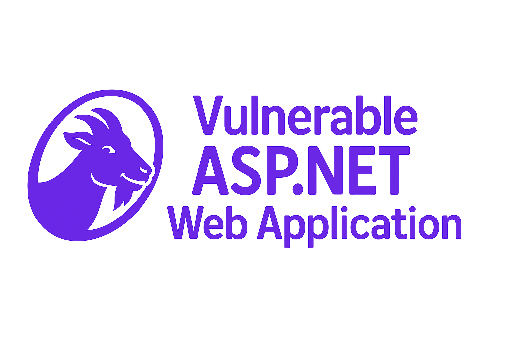

<div align="center">



# 🛡️ AspGoat

### Intentionally Vulnerable ASP.NET Core Application for Security Education

[](https://dotnet.microsoft.com/)
[](https://owasp.org/www-project-top-ten/)
[](https://www.docker.com/)
[](https://github.com/mudassiralladatkhan/AspGoat/stargazers)
[](LICENSE)

<br/>

**Learn web security by exploiting real vulnerabilities in a safe, controlled environment.**

[Get Started](#-quick-start) · [Vulnerabilities](#-vulnerability-categories) · [Contributing](CONTRIBUTING.md)

---

</div>

## 🎯 What is AspGoat?

AspGoat is a deliberately vulnerable web application built with **ASP.NET Core** designed for:

- 🎓 **Students** learning web application security
- 🔴 **Red teamers** practicing exploitation techniques
- 🔵 **Blue teamers** understanding attack patterns for better defenses
- 📝 **Developers** learning secure coding by seeing what NOT to do

Unlike generic vulnerable apps, AspGoat targets the **.NET ecosystem** specifically — the same stack used in enterprise environments worldwide.

---

## 🕷️ Vulnerability Categories

| # | Category | Status | Difficulty |
|---|----------|--------|------------|
| 1 | **SQL Injection** | ✅ Implemented | 🟢 Beginner |
| 2 | **Reflected XSS** | ✅ Implemented | 🟢 Beginner |
| 3 | **Stored XSS** | ✅ Implemented | 🟢 Beginner |
| 4 | **Insecure Deserialization** | ✅ Implemented | 🔴 Advanced |
| 5 | **Broken Authentication** | ✅ Implemented | 🟡 Intermediate |
| 6 | **Sensitive Data Exposure** | ✅ Implemented | 🟡 Intermediate |
| 7 | **XML External Entity (XXE)** | ✅ Implemented | 🔴 Advanced |
| 8 | **Broken Access Control** | ✅ Implemented | 🟡 Intermediate |
| 9 | **Security Misconfiguration** | ✅ Implemented | 🟢 Beginner |
| 10 | **CSRF** | ✅ Implemented | 🟡 Intermediate |
| 11 | **Command Injection** | ✅ Implemented | 🔴 Advanced |

---

## 🚀 Quick Start

### Option 1: Docker (Recommended)

```bash
git clone https://github.com/mudassiralladatkhan/AspGoat.git
cd AspGoat
docker build -t aspgoat .
docker run -p 5000:5000 aspgoat
```

### Option 2: .NET CLI

```bash
# Prerequisites: .NET 6.0+ SDK
git clone https://github.com/mudassiralladatkhan/AspGoat.git
cd AspGoat
dotnet restore
dotnet run
```

Navigate to `http://localhost:5000` and start hacking.

---

## 🏗️ Architecture

```
AspGoat/
├── Controllers/
│   ├── HomeController.cs      # Vuln endpoints (SQLi, XSS, XXE, Deserialization)
│   └── AccountController.cs   # Auth vulnerabilities (Broken Auth, Access Control)
├── Models/
│   ├── User.cs                # User model with weak validation
│   ├── Comment.cs             # Stored XSS vector
│   ├── DeserializationDemo.cs # Insecure deserialization target
│   ├── EmailId.cs             # IDOR reference
│   └── SafeMessage.cs         # Comparison: secure implementation
├── Data/
│   └── ApplicationDbContext.cs # EF Core context (SQLite backend)
├── Views/
│   ├── _ViewImports.cshtml    # Tag helpers
│   └── _ViewStart.cshtml      # Layout config
├── wwwroot/                    # Static assets + intentionally exposed files
├── Database/                   # SQLite database storage
├── Dockerfile                  # Container deployment
├── Program.cs                  # App configuration (intentional misconfigs)
└── appsettings.json           # Exposed secrets (intentional)
```

---

## 🔬 Exploitation Examples

### SQL Injection (via X-Forwarded-For)

```csharp
// VULNERABLE — string concatenation in SQL
string query = "SELECT * FROM Users WHERE LastLoginIP = '" + ip + "'";
```

**Exploit:**
```http
GET /Home/SqlInjection HTTP/1.1
X-Forwarded-For: ' OR '1'='1' --
```

### Reflected XSS

```
/Home/ReflectedXSS?query=<script>alert(document.cookie)</script>
```

### Stored XSS (via Comments)

```http
POST /Home/StoredXSS
Content-Type: application/x-www-form-urlencoded

comment=
```

---

## 🛡️ Secure Alternatives

Each vulnerability has a documented secure fix:

| Vulnerability | Secure Fix |
|---------------|-----------|
| SQL Injection | Parameterized queries / EF Core LINQ |
| XSS | Razor HTML encoding + Content-Security-Policy |
| Deserialization | TypeNameHandling.None + allowlist |
| CSRF | `[ValidateAntiForgeryToken]` attribute |
| Auth | ASP.NET Identity + 2FA |

---

## ⚠️ Disclaimer

> **This application is intentionally vulnerable.** Do NOT deploy it on any public-facing server or production environment. Use it only in isolated lab environments for educational purposes.

---

## 🤝 Contributing

We welcome contributions! See [CONTRIBUTING.md](CONTRIBUTING.md) for guidelines.

Ideas:
- Add new OWASP 2021 vulnerability categories
- Write CTF-style walkthrough guides
- Add difficulty levels and hints system
- Build automated exploit verification scripts

---

## 📊 Project Stats

- ⭐ **22 stars** — organic community growth
- 🔀 Used as a pentesting reference tool by security researchers
- 📦 Docker-ready for instant lab deployment
- 🏷️ 16 topics for maximum discoverability

---

<div align="center">

**Built with 💀 by [Mudassir Alladatkhan](https://github.com/mudassiralladatkhan)**

*Learn to hack. Learn to defend. Stay ethical.*

</div>
